# Women's Super League (WSL) Quiz

## Developer: Róisín O'Connell 

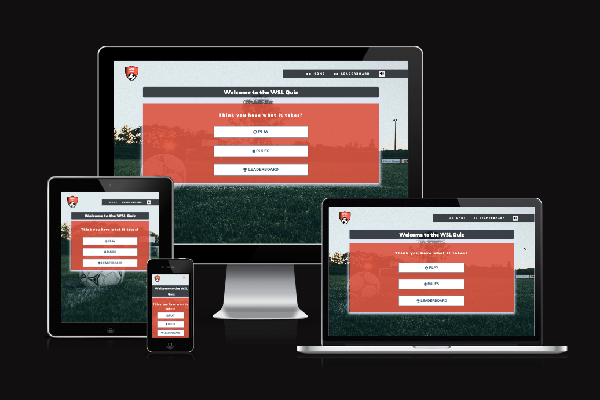

[View the live project here](https://roc-11.github.io/wsl-quiz/)

[View GitHub repository](https://github.com/roc-11/wsl-quiz)

## Table of Contents

- [Women's Super League (WSL) Quiz](#womens-super-league-wsl-quiz)
  - [Developer: Róisín O'Connell](#developer-róisín-oconnell)
  - [Table of Contents](#table-of-contents)
  - [Introduction](#introduction)
  - [Aim](#aim)
    - [Application Goals](#application-goals)
    - [User Goals](#user-goals)
  - [UX](#ux)
    - [User-Stories](#user-stories)
    - [Development-Planes](#development-planes)
      - [Strategy](#strategy)
      - [Scope](#scope)
      - [Structure](#structure)
      - [Skeleton](#skeleton)
    - [Design](#design)
      - [Colour Scheme](#colour-scheme)
      - [Typography](#typography)
      - [Imagery](#imagery)
  - [Features](#features)
    - [Navigation](#navigation)
    - [Sound Button](#sound-button)
    - [Homepage](#homepage)
    - [Rules Modal](#rules-modal)
    - [Quiz Page - Question and Answers](#quiz-page---question-and-answers)
    - [Quiz Page - Loader](#quiz-page---loader)
    - [Heads Up Display (HUD)](#heads-up-display-hud)
      - [Progress Bar and Text](#progress-bar-and-text)
      - [Score](#score)
    - [End Page - Submit Score](#end-page---submit-score)
    - [Leaderboard](#leaderboard)
    - [404 - Page Not Found](#404---page-not-found)
    - [500 Page](#500-page)
    - [Features to Implement in the future](#features-to-implement-in-the-future)
  - [Technologies Used](#technologies-used)
    - [Main Languages Used](#main-languages-used)
    - [Frameworks, Libraries \& Programs Used](#frameworks-libraries--programs-used)
  - [Testing](#testing)
  - [Responsiveness](#responsiveness)
  - [Bugs/Known Issues](#bugsknown-issues)
  - [Deployment](#deployment)
    - [Deploying on GitHub Pages](#deploying-on-github-pages)
  - [Credits](#credits)
    - [Content](#content)
    - [Media](#media)
    - [Code](#code)
  - [Acknowledgements](#acknowledgements)

***

## Introduction

"WSL Quiz" is an interactive quiz that users can take to test their knowledge of the Women's Super League - England's top tier professional women's football league.

The quiz dynamically presents the user with questions, provides visual and auditory feedback for a correct/incorrect answer, tracks what question users are currently on and also tracks the user's score. The user can earn a maximum of 100 points. 

The purpose of the quiz is to test the knowledge of WSL fans. With the women's game growing at a rapid pace after the World Cup 2023, this quiz also serves to increase knowledge for anyone who would like to learn more about the WSL. 

This website was made for the second of five Milestone projects required to complete the Diploma in Full Stack Software Development (e-Commerce Applications) program at [Code Institute](https://codeinstitute.net/ie/ "Link to Code Institute homepage").

The main requirements of this project are to build an interactive, responsive application using Javascript.

## Aim

The aim of the WSL Quiz is mainly to test user’s knowledge of the Women's Super League, in an interactive and fun way. The quiz also serves to let user’s learn more about the WSL by taking part in the quiz. 

### Application Goals

* To provide user’s with an interactive quiz, testing their knowledge of the Women's Super League.
* To provide feedback to user’s who take part in the quiz.
* To challenge user’s to get a high score, so that they can get added to the leaderboard.
* To increase a user’s knowledge about the WSL, if they are interested in learning more. 

### User Goals

- Navigate easily through the website
- Take part in the quiz; selecting answers and getting feedback
- Add high score to the leaderboard (if it qualifies)
- Control whether sound is on/off
- Enjoy taking part in an interactive quiz game

[Back to top ⇧](#womens-super-league-wsl-quiz)

## UX

### User-Stories

User Story 1: User new to the women's football environment and looking to build knowledge and test what I already know about the sport. I want to play a WSL Quiz to learn more about the WSL and enjoy the quiz experience.

User Story 2: User who is a fan of the WSL or women's football in general. I want to test my knowledge but I also want to challenge myself by achieving a high score and earning a place on the leaderboard.

### Development-Planes

To create a comprehensive application that fulfills the above user stories and identifies the functionality of the site.

#### Strategy

Strategy incorporates user needs as well as service objectives. This website will focus on the following target audience:
- Roles:
  - User Story 1
  - User Story 2
- Demographic:
  - All ages
  - Fans of the Women's Super League (mainly residing in England and Ireland)
  - New to women's football (probably off the back of the success of the Women's World Cup 2023)

The application needs to enable the user to:

- Navigate easily through the website
- Take part in the quiz; selecting answers and getting feedback
- Add high score to the leaderboard (if it qualifies)
- Control whether sound is on/off
- Enjoy taking part in an interactive quiz game

#### Scope

The scope plane is about determining the requirements based on the goals established on the strategy plane.
* Content Requirements - the user will need to find the information defined above.
* Functionality Requirements - the user will need to be able to easily navigate the site to take part in the quiz and view the leaderboard.

#### Structure

The information was organised into a heirarchical tree structure (a site map) making clear how users would navigate the website with ease.

The site map can be found below:

Strategy Plane

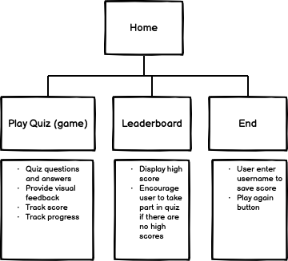

#### Skeleton

The appearance of each page of the application was planned by making wireframes. It was essential to provide a positive user experience for the user. 

Initially, wireframes plans were hand-drawn on a notepad. More detailed wireframes were then created using a desktop version of [Balsamiq](https://balsamiq.com/ "Link to Balsamiq homepage"). 

Some layout modifications were made during site development, however, most planned features are included in the final WSL Quiz application. They can be found below:

Balsamiq Wireframe - Desktop

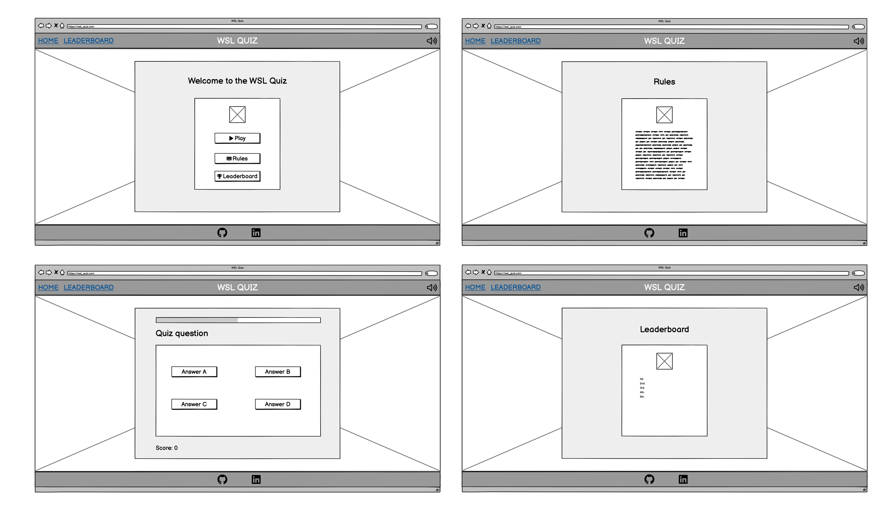

Balsamiq Wireframe - Mobile

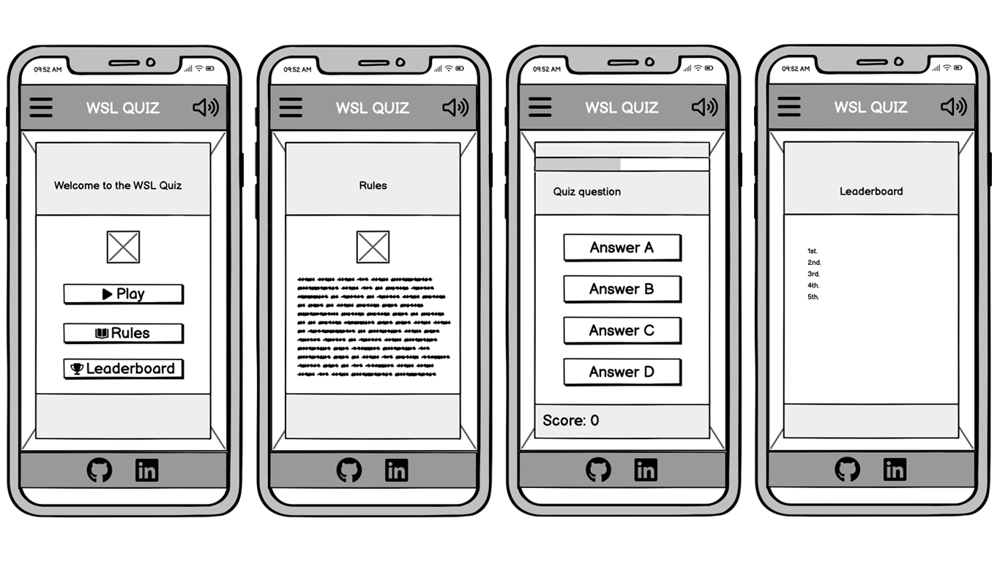

### Design

#### Colour Scheme

The colourscheme was inspired by the theme 'Burnt Sienna Orange + Bedazzled Blue Color Palette' on [venngage.com](https://venngage.com/blog/blue-color-palettes/). The shades of blue mixed with burnt orange provide a high contrast and complementary colours. I thought the orange/blue contrast gave the quiz the pop I wanted and found it to be visually appealing for the user.

As the wesbite development progressed, I decided to combine the blue/orange shades with simple white font and a black navigation bar. 

All text is coloured either charcoal (#3a3a3a) or white, depending on which background colour it needs to contrast with (essential for accessibility).

Details of the full colour palette can be found below:

Colour Palette

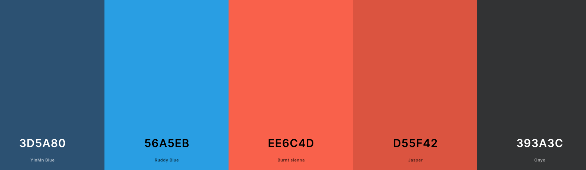

#### Typography

The pairing chosen for the site are:

- [Palanquin Dark](https://fonts.google.com/specimen/Palanquin+Dark)
- [Roboto](https://fonts.google.com/specimen/Roboto)
- A backup of 'Lato' and sans-serif are applied in case of failure.
- [Rubik](https://fonts.google.com/specimen/Rubik) is used for the leaderboard table.

Palanquin Dark is used for title headings, while Roboto is used for almost all other text (aside from Rubik on the leaderboard). Both were imported from [Google Fonts](https://fonts.google.com/).

#### Imagery

The background image was sourced from [Pexels](https://www.pexels.com/). The image is called 'Sky Sunset Field Sunrise' by [Markus Spiske](https://www.pexels.com/@markusspiske/). All images have been compressed in order to speed up loading and processing times, particularly on mobile devices. The images chosen are in line with the theme of the site.

I used Adobe Photoshop to resize the background image for better display on smaller device screens. 

[Back to top ⇧](#womens-super-league-wsl-quiz)

## Features

### Navigation

- Featured at the top of the page, the navigation shows the WSL Quiz logo in the left corner.
- The other navigation links are to the right: Home, Leaderboard (only Home on Game page) which link to different pages of the site.
- The navigation is in an uppercase, white font which contrasts with the dark background.
- The active page which the user is currently on is underlined.
- When the user hovers over a link, the link is clearly underlined.
- The navigation makes clear the name and purpose of the website.
- The navigation makes the different sections of information easy to find.
- The navigation bar collapses on mobile screens into a burger menu. When clicked it opens from screen right in a transparent overlay.
  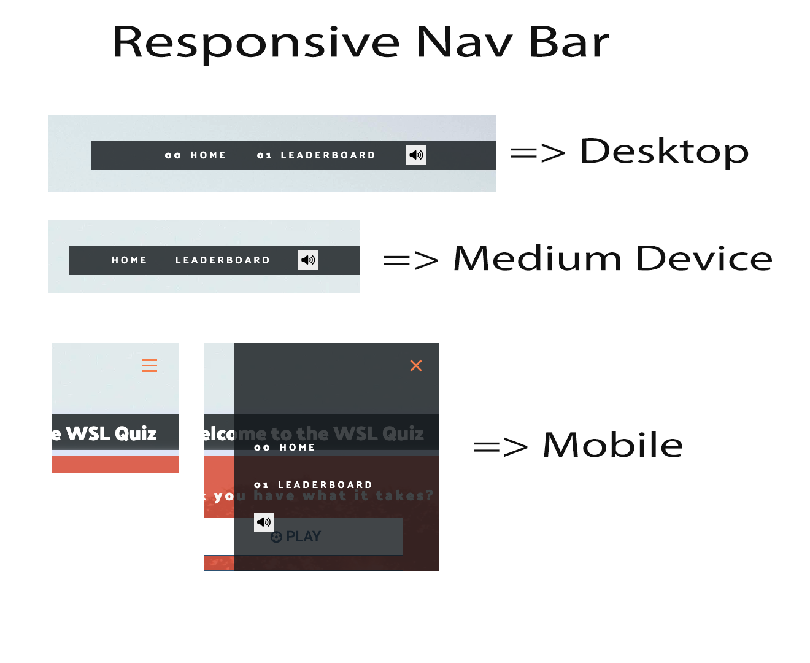

### Sound Button

- A sound/mute button is included to give the user control over the audio that is included on the site.
- The button appears as a volume up icon when the sound is on, and a mute button when the sound is off.
  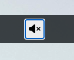

### Homepage

- The homepage features a large heading which makes clear the purpose and function of the site.
- The subheading challenges the user to take part in the quiz.
- The user is presented with 3 buttons which perform different functions:
  - Play - which takes the user to the quiz
  - Rules - which opens the rules modal (#rules-modal)
  - Leaderboard - which takes the user to the leaderboard/high scores page (#Leaderboard)
- When a user hovers over a button there is a subtle css transform which moves the button slightly and a blue shadow, to indicate the hover action.
- If sound is on, a fotball referee whistle sound will play when PLAY is clicked
  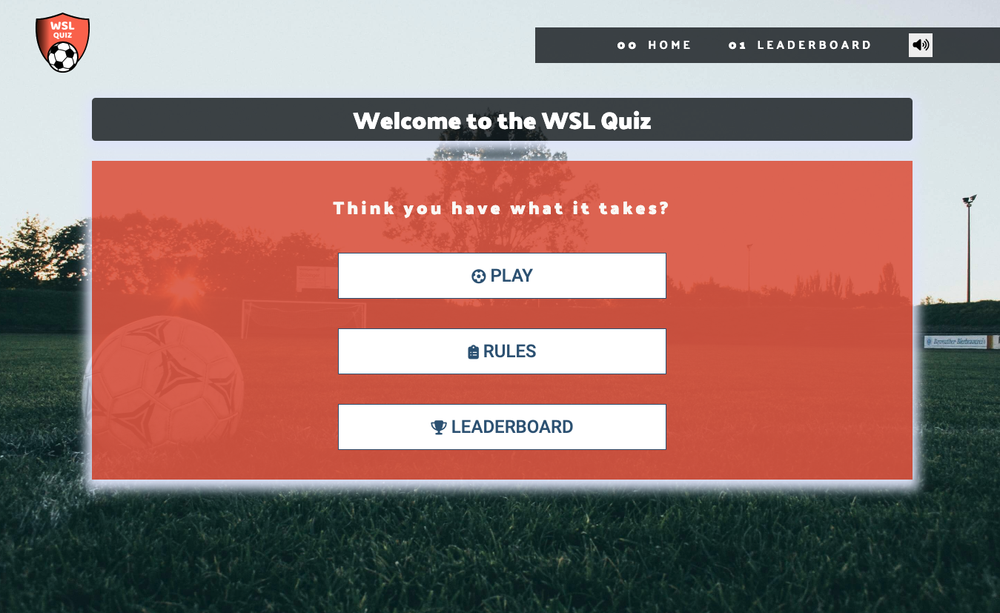

### Rules Modal

- When the RULES button is click, a rules modal will show on screen. 
- The modal contains information for the user on how the quiz game and scoring system works.
- The user can easily close the modal by clicking the CLOSE button.
- The modal is displayed using Javascript, so the page does not need to be reloaded.
- While the modal is active, the background will be disabled. This is indicated to the user by a color change (subtle gradient.)
  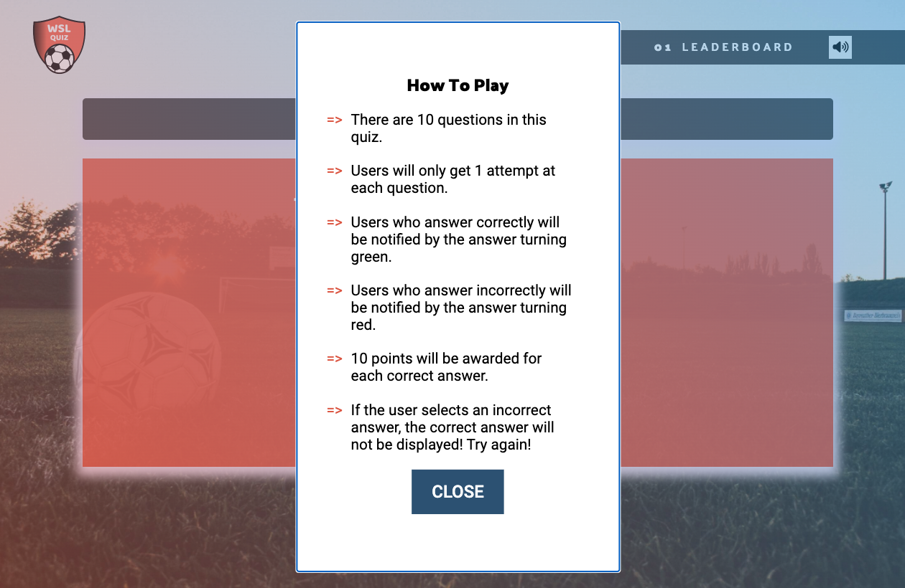

### Quiz Page - Question and Answers

- The quiz page contains the main functionality of the site. The user is presented with a HUD, question and answer, all contained within a blue box (in keeping with the theme).
- The quiz will display 1 of 10 questions, in a random order when the quiz begins. 
- The user is presented with 4 possible answers for each question.
- If a user answers correctly, the correct answer will display in green and if the sound is on a correct answer sound will play. These provide the user with visual and auditory feedback. 
- If a user answers incorrectly, the answer they selected will display in a red colour. The correct answer will not be shown in this case. This encourages the user to re-take the quiz and try to improve on their score. 
  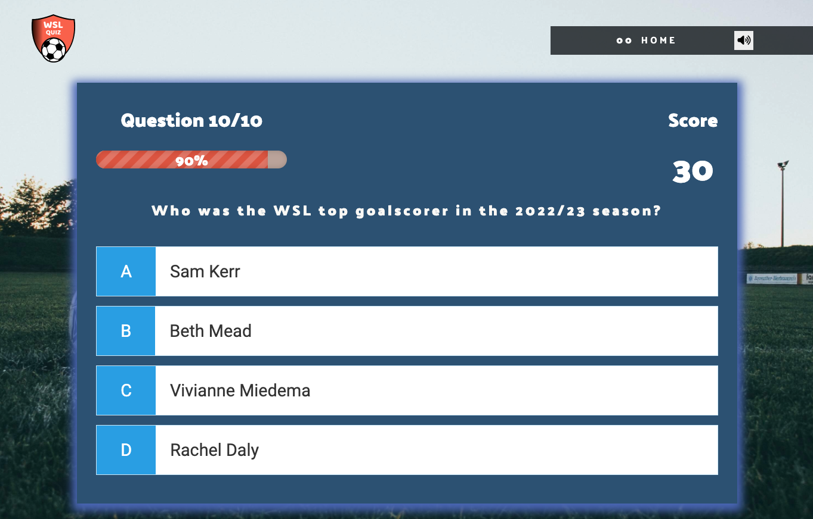
  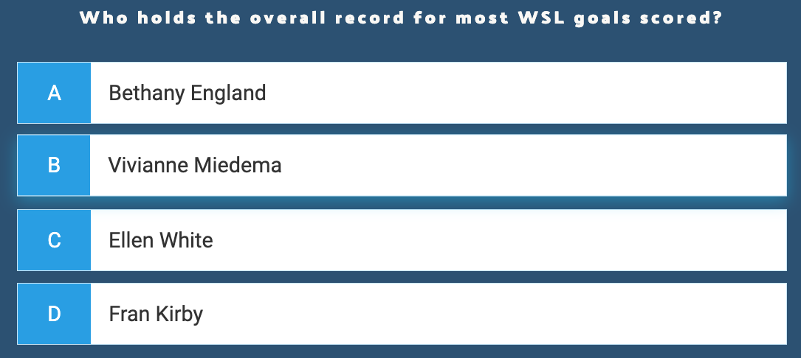

### Quiz Page - Loader

- While the quiz is loading, the user will see a loader to indicate that the quiz is loading.
  

### Heads Up Display (HUD)

The heads up display provides the user with information about their progress during the quiz and also about their current score.

#### Progress Bar and Text

- The lollipop progress bar shows the user how they are progressing through the quiz. They can visually see the % in text form, as well as how much of the bar is currently full. 
- The bar is orange in keeping with the WSL Quiz theme.
- The progress bar is updated through Javascript as the user progresses through the quiz.
- The question number is also displayed in text form above the progress bar.
 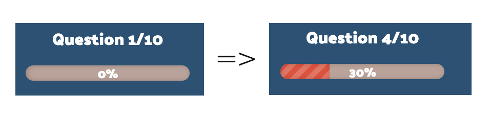

#### Score

- The user's current score is shown on the HUD in clear text. 
- The score is updated as the user progresses through the quiz.
- The final score is passed to the end page so that the user can save it to the leaderboard.
  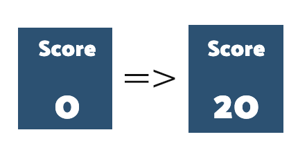

### End Page - Submit Score

- When the user finishes the quiz they are taken to the end page.
- The end page shows the user their final score in large text.
- There is an input box for the user to enter their name, so that their name will be saved to the leaderboard. 
- The save button is disabled until the user enters a username. After a username is entered, the Save button becomes enabled.
- The user also has the option to click the button to PLAY AGAIN (taking the quiz again) or return HOME, without saving their score.
  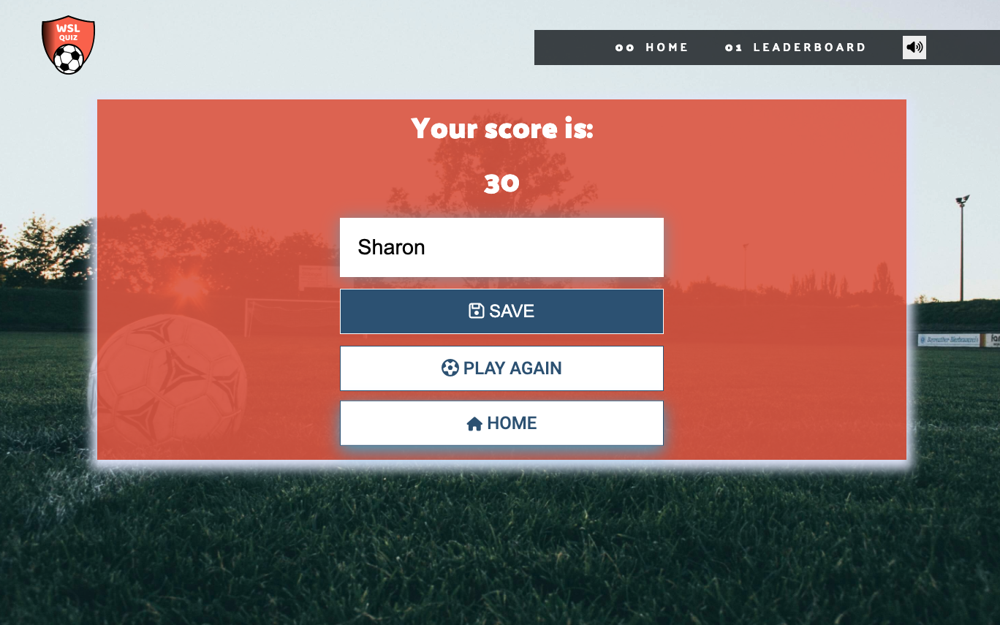
  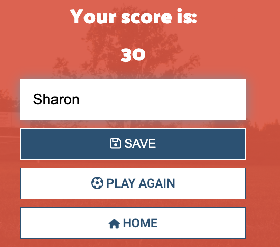

### Leaderboard

- The leadboard page displays the top 5 high scores from the quiz, in the form of a visually appealing table.
- A blue ribbon is shown on the top score (first table row) - to highlight the top quiz score.
- If there are no high scores saved in local storage, the leaderboard will display a message encouraging the user to take the quiz in order to get on the leaderboard.
- If there are high scored saved, they will be shown. A trophy image, the username and the score are displayed for each high score. The maximum number of high scores saved/displayed is 5.
- Users can hover over each row for some interactivity.
- The leaderboard page also features a PLAY button, taking the user directly to the quiz.
 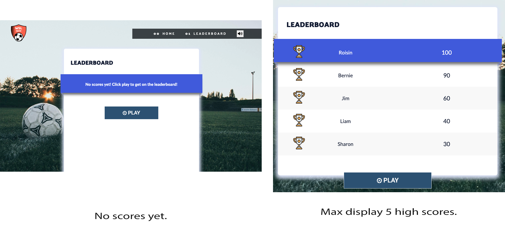

 ### 404 - Page Not Found

* The 404 page is a single page in the case of the user entering the incorrect address into the address bar. 
* The page informs the user that the page was not fount and encourages them to click the button, taking them directly back to the website home page. 
  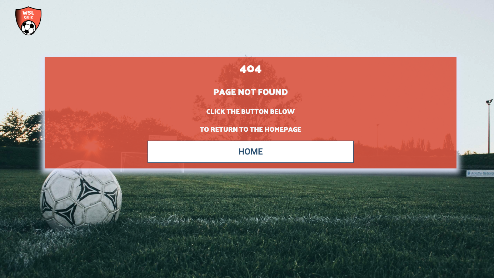

### 500 Page

* The 500 page is the same as the 404 page, except for a different heading telling the user there was an internal server error.
  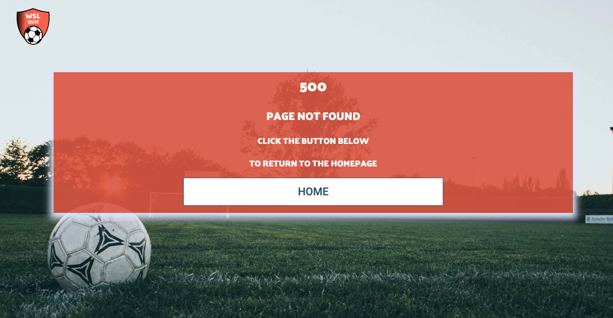
  
### Features to Implement in the future

In the future I would like to build upon the quiz functionality. 
1. Add different levels of difficulty to provide an extra challenge for WSL experts, and easy version for user's who are new to women's football.
2. Add a timer to the quiz, so that users get a limited time for each question.
3. 
This was beyond the scope of this project as time was limited, however, it would greatly add to the user experience of the WSL Quiz site.

[Back to top ⇧](#womens-super-league-wsl-qui)

## Technologies Used

* HTML5 - for creation of markup for the website/application content.
* CSS3 - cascading style sheets used to style the application.
- Javascript - Scripting language used to add interactivity to the quiz application, mainly through DOM manipulation.

### Main Languages Used

* HTML5
* CSS3
* JavaScript

### Frameworks, Libraries & Programs Used

* [Google Fonts](https://fonts.google.com/)
  * Google fonts was used to import the fonts "Palanquin Dark", "Roboto", and "Rubik" into the style.css file. These fonts were used throughout the project.
* Font Awesome
  * [Font Awesome](https://fontawesome.com/) was used on almost all pages throughout the website to import icons (e.g. button icons) for UX purposes.
* CodeAnywhere
  * [CodeAnywhere](https://codeanywhere.com/signin) was used for writing code, commiting, and then pushing to GitHub.
  * IDE used to code the project.
* [GitHub](https://github.com/)
  * GitHub was used to store the project after pushing
* [Adobe Photoshop](https://www.adobe.com/ie/ "link to the adobe homepage")
  * Adobe Photoshop was used to resize images
* [Balsamiq](https://balsamiq.com/)
  * Balsamiq was used to create the wireframes during the design phase of the project.
* [Am I Responsive?](https://ui.dev/amiresponsive)
  * 'Am I Responsive' was used to visualise responsive design throughout the process and to generate mockup imagery.
* [Free Logo Design](https://www.freelogodesign.org/)
  * Free Logo Design was used to generate a logo for the website.
* [TinyPNG](https://tinypng.com/)
  * TinyPNG was used for image compression and to improve wesbite load speed.
* [EZgif](https://ezgif.com)
  * EZgif was used to convert screen recording videos to .gif files for the TESTING.md file
* [Google Chrome Dev Tools](https://developer.chrome.com/docs/devtools/)
  * Google Chrome Dev Tools was used during the testing phase to test the responsiveness of the site and to check for any bugs.
* [Pexels](https://www.pexels.com/)
  * Pexels was used as a source for the background image. 
* [w3schools](https://www.w3schools.com)
  * w3schools was used as a guide for Javascript usage and syntax throughout the project.

## Testing

Testing information can be found in a separate testing [file](TESTING.md "Link to testing file")

[Back to top ⇧](#womens-super-league-wsl-quiz)

## Responsiveness

Google Webdev tools were used throughout the project in order to ensure the site was responsive and user-friendly across a range of device and screen sizes.

The breakpoints used within the site are 950px, 800px, 580px, 440px and 360px.

In general, much of the site content is displayed using flex CSS in either flex-rows or flex-columns. The screen space is optimised for the user by doing this.

There were responsivity issues regarding the display of all the quiz and hompage containers on smaller screens. This was a CSS issue from the initial development when body height = 100vh had to be removed. 

The website is full responsive and all functions are displayed correctly.

[Back to top ⇧](#womens-super-league-wsl-quiz)

## Bugs/Known Issues

During initial testing, there were a few bugs discovered. After testing for various screen sized, there was a lot of work to do in oder to make the website responsive. I had set the body height to 100vh, which caused many issues on mobile devices and took a lot of effort to resolve. My initial footer was unnecessary and distracting for the user experience so I removed it while testing the site. 

The necessary changes were made an the website is now fully responsive.

I had difficulty implementing the audio sound features at first. As I scripted the quiz across multiple HTML and JS files, it was not possible for the mute button to work smoothly across the site at first, so I decided to use local storage to achieve the functionality I wanted to achieve.

I also had some issues around file paths. Everything functioned as expected in the development environment, and it was not until I deployed the site that the issues become clear. I suspected my file paths on links (buttons) were incorrect. I consulted my peers on Slack but they had similar file paths and directories. The problem lay in a simple "window." preceding "location.href" when setting the href in the Javascript code. All links now work as expected.

There are currently no known bugs/issues with the website.

[Back to top ⇧](#womens-super-league-wsl-quiz)

## Deployment

This project was developed using [CodeAnywhere](https://codeanywhere.com/ "Link to CodeAnywhere site"), which was then committed and pushed to GitHub using the GitPod terminal.

### Deploying on GitHub Pages

In oder to deploy this page to GitHub Pages from its GitHub repository, the following steps were taken:

1. Log in to [GitHub](https://github.com/login "Link to GitHub login page") or [create an account](https://github.com/join "Link to GitHub create account page").
2. Locate the [GitHub Repository: WSL Quiz](https://roc-11.github.io/wsl-quiz/ "Link to GitHub Repo").
3. At the top of the repository, locate 'Settings' from the menu items.
4. Scroll down the settings page until you reach 'Pages' in 'Code and
automation' section.
1. Under 'Source' click the drop-down menu labelled 'Select Branch' and select 'Main'. Click the dropdown called 'Select folder' and select '/root'.
2. Upon selection, the page will automatically refresh meaning that the website is now deployed.
3. Scroll back down to the 'Pages' section to retrieve the deployed [link](https://roc-11.github.io/wsl-quiz/)

[Back to top ⇧](#womens-super-league-wsl-quiz)

## Credits

### Content

The content and facts to inspire the quiz questions was taken from [Wikipedia Women's Super League page](https://en.wikipedia.org/wiki/Women%27s_Super_League).

### Media

* The WSL Quiz logo was generated on [Free Logo Design](https://www.freelogodesign.org/ "Link to Free Logo Design Home Page"). 
* The background image was sourced on [Pexels](https://www.pexels.com/ "Link to Pexels.com") by [Markus Spiske](https://www.pexels.com/@markusspiske/).
* The icons across the site were sourced from [Font Awesome](https://fontawesome.com/ "Link to Font Awesome homepage")
  
### Code
The developer consulted multiple sites in order to better understand the code they were trying to implement. For code that was copied and edited, the developer made sure to reference this with the code.The following sites were used on a more regular basis:
- [Stack Overflow](https://stackoverflow.com/ "Link to Stack Overflow page")
- [W3Schools](https://www.w3schools.com/ "Link to W3Schools page") 
  
The following credits are linked in the HTML, JS and CSS files. Code was copied and adapted to suit the application from the following sources:
- [YouTube](https://www.youtube.com)
  - YouTube tutorials were used as inspiration for many elements of the project, listed below (and included in project code):
  - Responsive Nav Bar by [Kevin Powell](https://www.youtube.com/watch?v=HbBMp6yUXO0)
  - Build A Quiz App by [James Q Quick](https://www.youtube.com/watch?v=rFWbAj40JrQ)
  - Dialog = the easiest way to make a popup modal by [Kevin Powell](https://www.youtube.com/watch?v=TAB_v6yBXIE)
- [Codepen](https://codepen.io/)
  - Leaderboard by [Malunari](https://codepen.io/MalunariDev/pen/RweGGxx)
  - Lollipop Progress Bar with Percentage by [Danilo Bilanoski](https://codepen.io/dbilanoski/pen/NZmOJR)

## Acknowledgements

* My family for assisting me in the testing of the website.
* Code Institute Slack community for their helpful opinions, advice and feedback.

[Back to top ⇧](#womens-super-league-wsl-quiz)
