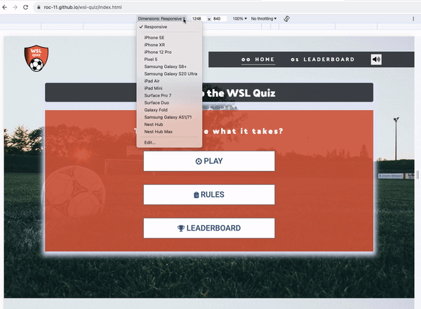
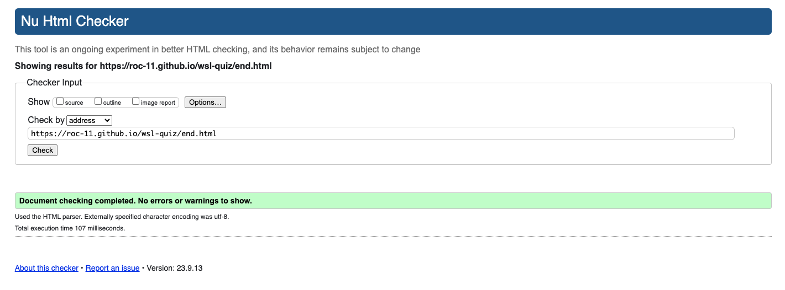
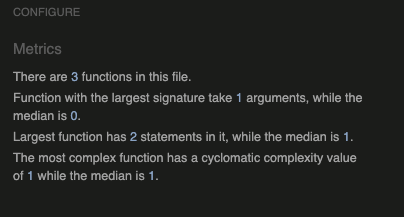

# WSL Quiz - Testing

[Main README.md file](/README.md)

[View live project](https://roc-11.github.io/wsl-quiz/)

[View GitHub repository](https://github.com/roc-11/wsl-quiz)

***

## Table of contents

- [WSL Quiz - Testing](#wsl-quiz---testing)
  - [Table of contents](#table-of-contents)
  - [Browser Compatibility](#browser-compatibility)
  - [User Testing](#user-testing)
  - [Testing User Stories](#testing-user-stories)
    - [Current User](#current-user)
    - [New User](#new-user)
  - [Manual Testing](#manual-testing)
    - [Common Elements Testing](#common-elements-testing)
    - [Home Page](#home-page)
    - [Leaderboard Page](#leaderboard-page)
    - [Quiz Page](#quiz-page)
    - [End Page](#end-page)
    - [Error Pages - 404 and 500 Error Pages](#error-pages---404-and-500-error-pages)
  - [Validator Testing](#validator-testing)
    - [HTML Validation](#html-validation)
    - [CSS Validation](#css-validation)
    - [Javascript Validation](#javascript-validation)
  - [Performance](#performance)
  - [Accessibility](#accessibility)

***

## Browser Compatibility

The website has been tested on a range of browers: Google Chrome, Safari & Microsoft Edge. The results were satisfactory.

## User Testing

The entired project was manually tested by the developer to ensure all it appears correctly on a range of devices/screen size, and to ensure that all links work as expected.

The project was manually tested and reviewed by my mentor Koko during one mentor sessions. Her opinion was greatly appreciated and changes were made to the site after the session.

The project was also user tested by a some class colleagues on the [Slack](https://slack.com/intl/en-ie/) Code Institute community, and some of my family members. Their helpful advice and suggestions led to a few small UX changes in order to create a better experience.

## Testing User Stories

### Current User

1. As a current user, I want to be able to contact/book a physiotherapy session easily.
   - The Home Page has a "Book Now" button under the main hero image. Users can simply click this to take them to the contact us form and make a booking. If the site were real, an integrated booking system would also exist.
   - The user can click on the "Contact Us" link in the main navigation bar to take them to the contact us/booking form.
   - The user can find contact details in the form of an email address & phone number in the main footer. Both of these are clickable and perform actions.

2. As a current user, I want to easily navigate through the site and access the information I require.
   - The navigation bar is clearly defined and easily navigable for users to find and use.
   - The footer menu is easy to use with appropriate icons for easy identification.

3. As a current user, I want to easily navigate to content I have previously viewed within a small number of steps.
   - On all site pages there is a naviagtion bar with links to each required page.

### New User

1. As a new user, I want to easily navigate the entire site intuitively.
   - The navigation bar is clearly defined and easily navigable for users to find and use.
   - The footer menu is easy to use with appropriate icons for easy identification.
  
2. As a new user, I want to easily understand the main purpose of the site.

- The main purpose of the site is clear on the home page (hero image of physio, site slogan).
- The "how can we help you" section on the homepage clearly defines the services offered to clients.

3. As a new user, I want the information I seek to be easily accessible and relevant.

- The navigation bar is clearly defined and easily navigable for users to find and use.
- The footer menu is easy to use with appropriate icons for easy identification.
  
4. As a new user, I want attractive and relevant visuals and colour schemes that work with the content.
   - An attractive colour palette was created inpsired by the theme 'Close to Nature' on [Visme.com](https://visme.co/blog/website-color-schemes/).
   - Relavant images were found using [Pexels](https://www.pexels.com/ "Link to Pexels.com"), [Pixabay](https://pixabay.com/ "Link to Pixabay.com") and [Adobe Stock](https://stock.adobe.com "Link to Adobe Stock").
   - An attractive, professional logo image was created using [Looka.com](https://looka.com/onboarding "Link to Looka Home Page").

5. As a new user, I want to be able to contact/book a physiotherapy session easily.
   - The Home Page has a "Book Now" button under the main hero image. Users can simply click this to take them to the contact us form and make a booking. If the site were real, an integrated booking system would also exist.
   - The user can click on the "Contact Us" link in the main navigation bar to take them to the contact us/booking form.
   - The user can find contact details in the form of an email address & phone number in the main footer. Both of these are clickable and perform actions.

[Back to top ⇧](#wsl-quiz---testing)

## Manual Testing

### Common Elements Testing

Manual testing was conducted on the following elements that appear on every page:

- Clicking on the Navigation Bar's links will bring the user to the specified page.

     

- When the page is resized, and scaled down to a mobile device sized screen, the nav bar becomes a buger menu.

     

### Home Page

Manual testing was conducted on the following elements of the [Home Page](index.html):

- Clicking on the RULES button will open a modal. The background will display a gradient to show that it is disabled. The user can close the modal by clicking on the CLOSE button.

    

- Clicking on the PLAY button will take the user to the quiz page. A referee whistle sound will play, so the link is delayed for 80ms.

    

- The responsiveness of the Home page

    

### Leaderboard Page

Manual testing was conducted on the following elements of the [Leaderboard Page](leaderboard.html):

- Hovering over the leaderboard rows, the user will see a transform of the row to indicate hovering.
  
    

- The responsiveness of the Leaderboard page

    

### Quiz Page

Manual testing was conducted on the following elements of the [Quiz Page](game.html):

- The user can click on one of 4 answer buttons. Clicking a right answer will result in the answer turning green. Clicking an incorrect answer will result in the answer turning red. The user is shown their SCORE and PROGRESS in the HUD above the quiz questions & answers.

    

- The responsiveness of the Quiz Us page

    

### End Page

Manual testing was conducted on the following elements of the [End Page](end.html):

- The user can enter their username to save their score in the input area provided. Clicking save will save the score and take the user back to the homepage. The save button is disabled until some text is entered in the username textbox.

    

- The responsiveness of the End page

    

### Error Pages - 404 and 500 Error Pages

- The 404 and 500 error pages have a home button. Clicking on the "home" button will bring the user to the home page [index.html](index.html).
  
    

[Back to top ⇧](#wsl-quiz---testing)

## Validator Testing

### HTML Validation

All pages of the website were tested using the [W3C official HTML validation tool](https://validator.w3.org/). No errors were shown when the site was passed through this tool.

A previous pass through this tool showed multiple errors related to 'trailing slash on void elements'. An autoformat option has to be changed on the CodeAnywhere IDE in order to rectify these.

### CSS Validation

The Cascading Stylesheet code was tested using the [W3C CSS Validator](https://jigsaw.w3.org/css-validator/). No errors were found when the CSS was passed through this tool.

[Back to top ⇧](#wsl-quiz---testing)

### Javascript Validation

- Script.js - no errors were found when script.js was run through jshint validator.

- Game.js - there were three warnings when the game.js file was run through jshint validator. However, the warnings do not impact the quiz logic and was tested extensively to ensure it does not have an impact on the site.

- End.js - there was one warning when the end.js file was run through jshint validator. However, PlayAgainSound was called in the html onclick, so it was in fact used.

- Leaderboard.js - no errors were found when leaderboard.js was run through jshint validator.

[Back to top ⇧](#wsl-quiz---testing)

## Performance

[Lighthouse](https://www.webpagetest.org/lighthouse) Google Webdev tools were used to test the performance of the website.

[Back to top ⇧](#wsl-quiz---testing)

## Accessibility

[Wave](https://wave.webaim.org/) Web Accessibility Evaluation tool was used to check accessibility. It detected a minor alert where I have 2 home links on the nav bar (Home and Logo). The contrast check passed, as did all other accessibility checks.

Semantic markup was used when developing the site to ensure the site is readable for the visually impaired/those using screen readers and other forms of assistive technology. Alt text descriptions are included for all images and aria-labels for all links.

[Back to top ⇧](#wsl-quiz---testing)
